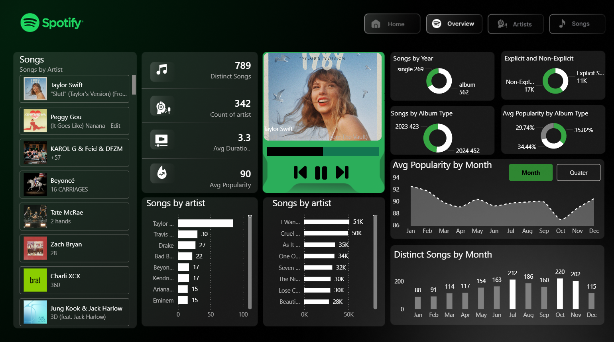

# Spotify Analytics Dashboard (Power BI)



## Overview

This project is an interactive **Spotify analytics dashboard** built using Power BI.  
It analyzes music metadata such as song popularity, artist performance, album types, and explicit content distribution.

The dashboard demonstrates how raw Spotify chart data can be transformed into meaningful insights through **Power Query, DAX measures, and data visualization**.

---

## Current Dashboard Pages

### Overview Page
The overview page provides a high-level summary of the dataset including:

- Total number of songs
- Distinct artists
- Average song popularity
- Average track duration
- Explicit vs non-explicit content distribution
- Song distribution by year
- Popular songs by artist
- Monthly popularity trends

### Artist Page *(In Progress)*
The artist page will focus on deeper analysis including:

- Top performing artists
- Song distribution by artist
- Artist popularity trends
- Top chart positions by artist

---

## Data Source

Dataset used: **Spotify Global Top 50**
The dataset used in this project is included in the repository:

data/spotify-top50-data.csv

Typical attributes include:

- song
- artist
- popularity
- duration_ms
- album_type
- release_year
- explicit flag
- chart position

The dataset is imported into Power BI using **CSV data sources**.

---

## Data Processing Workflow

CSV Dataset → Power Query Transformation → Data Model → DAX Measures → Power BI Dashboard


---

## Key Metrics Calculated

Key DAX calculations include:

- Total Songs
- Distinct Songs
- Distinct Artists
- Average Popularity
- Explicit vs Non-Explicit Song Counts
- Album Type Distribution
- Average Song Duration
- Popularity Trends

The full DAX measure library is documented in:

dax/dax-measures.md


---

## Technical Skills Demonstrated

- Power BI Dashboard Design
- Data Modeling
- DAX Measure Development
- Power Query Data Transformation
- Data Visualization
- Music Dataset Analysis

---

## Project Structure

## Project Structure

```
spotify-powerbi-dashboard
│
├── README.md
├── gitignore
├── dashboard/
│   └── Spotify_Dashboard.pbix
│
├── screenshots/
│   └── overview-dashboard.png
│
├── dax/
│   └── dax-measures.md
│
└── data/
    └── dataset-info.md
    └── spotify-top50-data.csv
```


---

## Future Improvements

- Complete Artist analytics page
- Add genre-level analysis
- Implement track-level drilldowns
- Build popularity trend forecasting

---

## Author

Darshita Patel  
Master's in Information Systems  
Illinois State University
